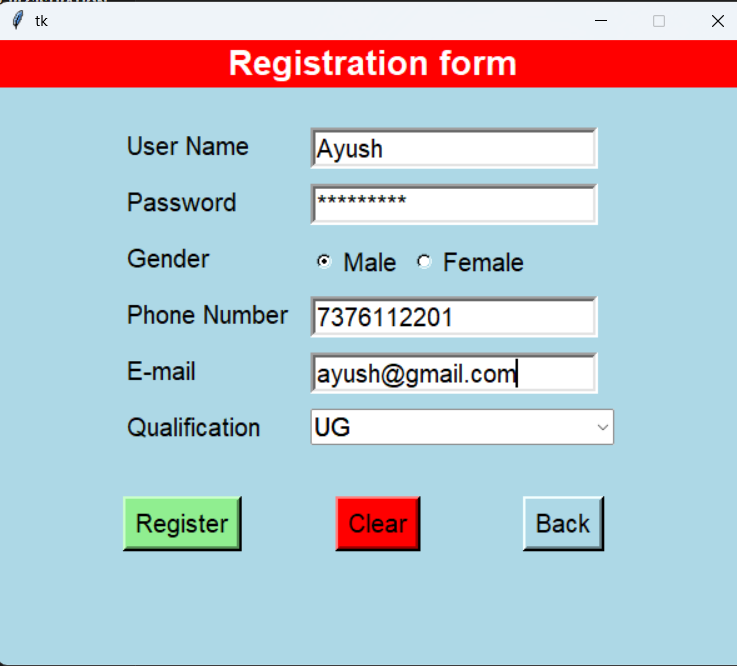
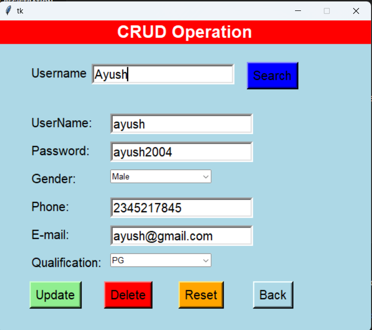

# Tkinter Registration & CRUD Application

A desktop application developed using **Python Tkinter** and **SQL Server** that allows user registration and CRUD operations.

---

## 🚀 Features
- User Registration Form
- Input Validation (Username, Password, Email, Phone)
- CRUD Operations (Create, Read, Update, Delete)
- SQL Server Database Connectivity
- Multi-page Tkinter UI

---

## 🛠️ Technologies Used
- Python
- Tkinter
- SQL Server
- pyodbc

---

## ▶️ How to Run
1. Clone the repository
   ```bash
   git clone https://github.com/ayushsingh201/Tkinter-registration-crud.git

2. Install dependencies
   '''bash 
      pip install -r requirements.txt

3. Run the application
   '''bash
    python main.py

```md
## 📸 Screenshots




